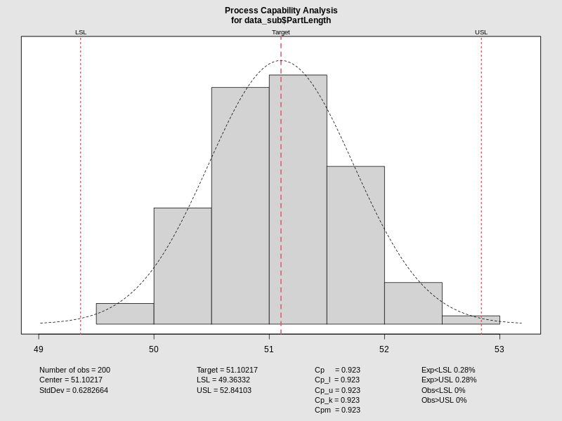
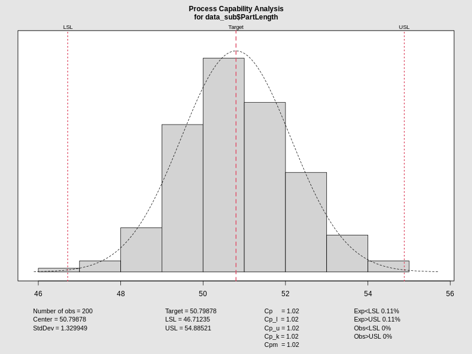
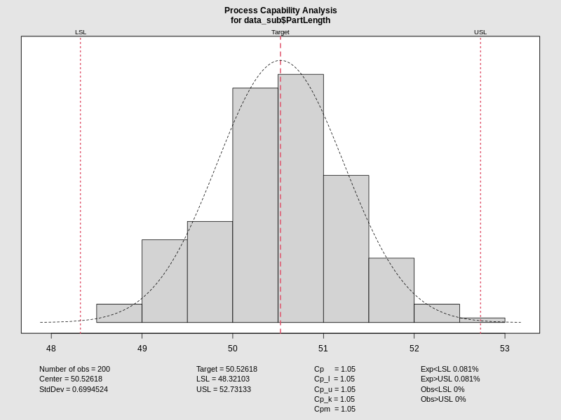

---

# Machine Analysis (338K, 200kPa)

Summarizing the control and capability for all three machines.

---

## Machine 1: Control & Capability

:::::::::::::: {{.columns}}
::: {{.column width="50%"}}
<iframe data-src='media/plots/control_m1.html' width='100%' height='500px' style='border:none;'></iframe>
:::

::: {{.column width="50%"}}

:::
::::::::::::::

---

## Machine 2: Control & Capability

:::::::::::::: {{.columns}}
::: {{.column width="50%"}}
<iframe data-src='media/plots/control_m2.html' width='100%' height='500px' style='border:none;'></iframe>
:::

::: {{.column width="50%"}}

:::
::::::::::::::

---

## Machine 3: Control & Capability

:::::::::::::: {{.columns}}
::: {{.column width="50%"}}
<iframe data-src='media/plots/control_m3.html' width='100%' height='500px' style='border:none;'></iframe>
:::

::: {{.column width="50%"}}

:::
::::::::::::::
